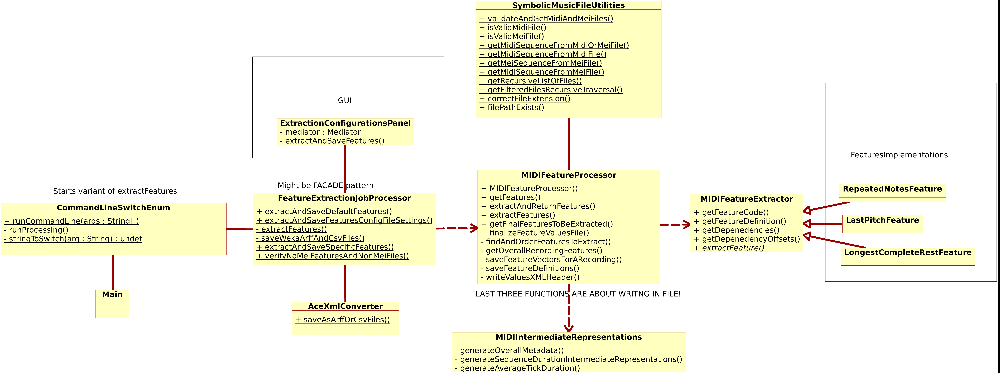
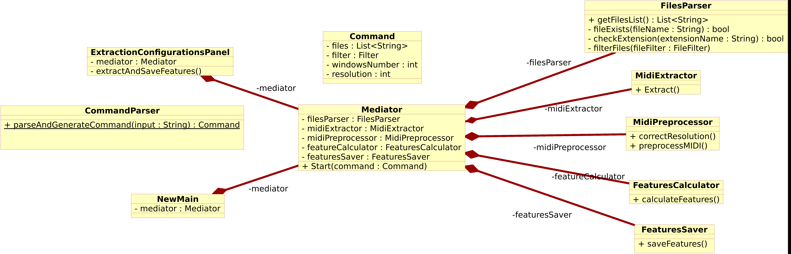
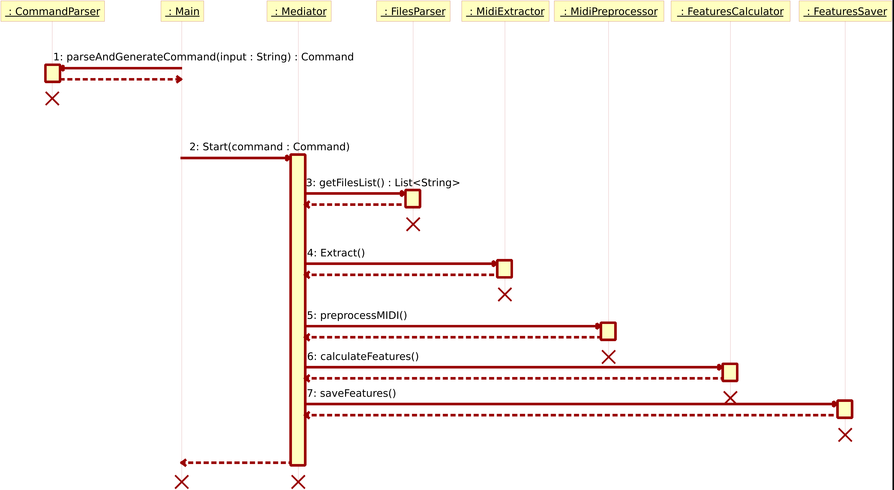

# REPORT 1

## Tests
Пофиксил все тесты. На сломанных тестах все тщательно проверил, посчитав на бумаге. Помогло отловить 
некие баги и в целом лучше понять логику кода.

## SonarQube
В бесплатной версии можно анализировать лишь 
одну ветку, однако есть баг благодаря которому эту бесплатную ветку можно постоянно менять, и таким образом 
анализировать все ветки. Локально запустил на докере и все работает, действительно
крутой инструмент, много чего полезного показывает. Пытался несколько дней подключить к github actions, но пока
не получилось (как-то надо Github App еще настраивать). В целом, пока можно остановиться на локальном использовании.
Однако у меня по github student pack можно получить бесплатный сервер на Digital Ocean на год и можно было бы на нем
развернуть бесплатный SonarQube, который бы уже анализировал ветки в репо. Если будет время, попытаюсь добить

## Bugs
Добавил MIDI аудиофайл на 40 минут (Long.mid). По нему легко было найти баги.

MIDIIntermediateRepresentations создает массив, длина которого равна количеству тиков в аудиофайле. Однако при обработке
большого аудиофайла выбрасывается OutOfMemory. Был создан класс MIDIUtils, который решает проблему уменьшением разрешения
файла. Однако есть проблемы с тем чтобы заимпленетить данный класс:
- Если делить файл на много windows, тогда нет смысла портить качество музыки, поэтому надо дать выбор пользователю.
- Почему именно такие константы мы выбираем для разрешения? Может, у пользователя совсем слабый комп и надо еще меньше
разрешение делать. Снова же, надо дать выбор пользователю
Получаем, что из-за плохой архитектуры кода эту фичу с разрешением уже сложно заимплементить. Пока как временное 
решение проверяем и снижаем resolution абсолютно всех файлов, но надо помнить, что это потом надо изменить.
В следующем пункте про новую архитектуру будет простое решение этой проблемы.

## Refactoring.
Создал UML диаграммы кода чтобы было проще в нем разобраться.

Исходная архитектура:

- Вообще странное взаимодействие CommandLineSwitchEnum и FeatureExtractionJobProcessor. Видимо, была попытка 
реализовать паттерн Фасад, который принимал бы команды от GUI и из терминала, но получилось плохо.
- FeatureExtractionJobProcessor и MIDIFeatureProcessor - полный fail по архитектуре: оба отвечают за вычисления,
оба отвечают за чтение и запись файлов. Тут single responsibility вообще не соблюден.

Теперь исходя из этих проблем решил сделать свой макет. Основная идея: используем паттерн посредника (Mediator),
который руководит всей работой.

- Main/GUI считывают настройки пользователя в Терминале/GUI, далее все настройки отправляют в CommandParser, который
генерит объект типа Command. Далее уже эту команду отправляем посреднику
- Посредник уже парсит команду и запускает последовательно все объекты. Думаю, из диаграмм по названию классов понятна 
дальнейшая логика
- Для взаимодействия между модулями нужен небольшой декоратор над Sequence, в котором как минимум надо указывать
расположение файла чтобы потом использовать эту информацию при записи описания в файлы.
(По-хорошему надо уметь поддерживать еще mei формат, поэтому нужен абстрактный контейнер, который либо содержит midi,
либо mei, либо любой другой формат)))

## TODO
1) Сделать hotfix с помощью MIDIUtils чтобы не было OOM.
2) Решить issues.
3) Сделать бенчмарк после фикса багов.
4) Доделать uml новой архитектуры.