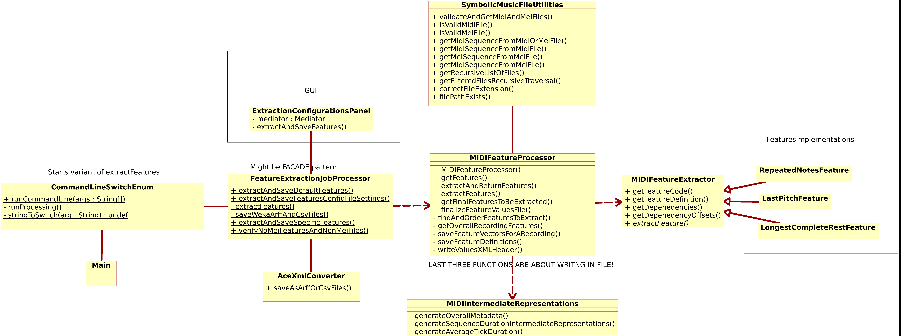
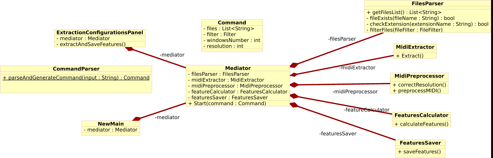
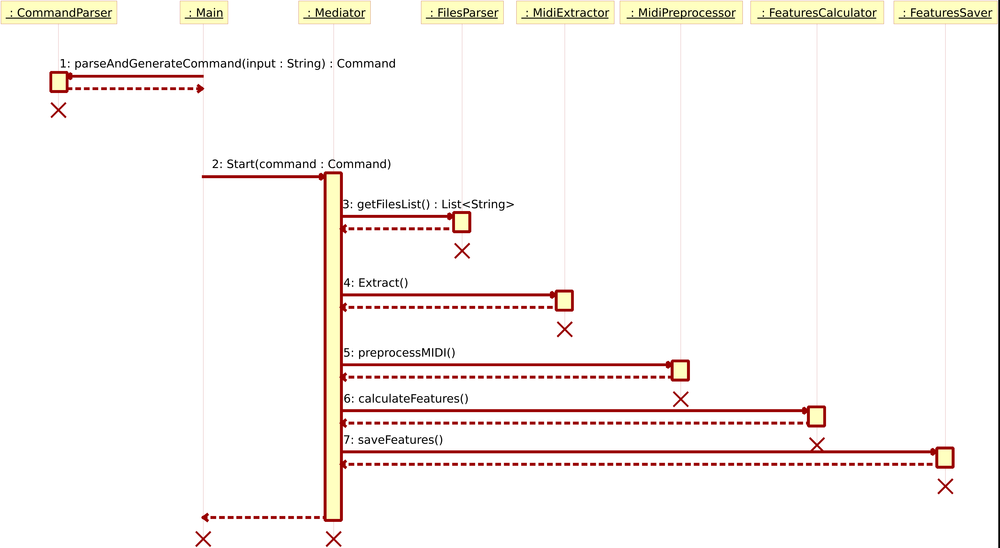

# REPORT 1

## Tests
All tests were fixed. Fixing helped to catch some bugs and better understand the logic of the code.

## SonarQube
In the free version, it is allowed to analyze only one branch. However, it has a bug that allows you to 
switch the free branch, thus analyzing all branches. I ran SonarQube locally on Docker and everything worked fine. I
t's really a cool tool that shows a lot of useful information.
I also had tried to connect it to GitHub actions for a few days, but it didn't work
(some configuration of Github App are required). 
In general, I can use it locally now. However, with my GitHub student pack, I can get a free server on Digital Ocean for 
a year and could deploy a free SonarQube on it, which would then analyze branches in the repository.
If I will have free time, I will try to accomplish that.

## Bugs
Added a MIDI audio file which duration is 40 minutes (Long.mid). It was easy to find bugs with the file.

MIDIIntermediateRepresentations creates an array which length is equal to the number of ticks in the audio file.
However, when processing a large audio file, an OutOfMemory error is thrown.
A class MIDIUtils was added to solve the problem by reducing the resolution of the file.
However, there are issues with implementing this class:
- If user divides the file into many windows, then there is no point in decreasing the quality of the music, so the user
should be given a choice.
- Why do we choose these constants for resolution? Maybe the user has a very weak computer and needs even lower resolution. Again, the user should be given a choice.

It turns out that due to poor code architecture, it is really difficult to implement this resolution feature.
For now, as a temporary solution, we check and reduce the resolution of all files absolutely, but in future 
we should fix that. 
In the next section about the new architecture, there will be a simple solution to this problem.

## Refactoring
I have created UML code diagrams to make it easier for understanding.

Original architecture (class diagram _cd_old.png_):
- Strange interaction between CommandLineSwitchEnum and FeatureExtractionJobProcessor. Apparently, there was an attempt to implement the Facade pattern that would receive commands from GUI and terminal, but it turned out poorly.
- FeatureExtractionJobProcessor and MIDIFeatureProcessor - a complete failure in terms of architecture: both are responsible for calculations, both are responsible for reading and writing files.
- Here, single responsibility is not observed at all.

Now, based on these problems, I decided to make my new architecture.
The main idea: use the Mediator pattern that manages all the processes.

- Main/GUI reads user settings in Terminal/GUI, then all settings are sent to CommandParser,
which generates an object of type Command. Then this command is sent to the mediator.
- The mediator parses the command and sequentially launches all objects.
I think from the class names in the diagrams, the further logic is clear.
- For interaction between modules, a small decorator above Sequence is needed, in which at least the file location
must be specified to use this information later when writing descriptions to files.
(Properly supporting mei format is needed as well, so an abstract container is needed that either contains midi, mei, or any other format)))

## TODO
1) Make a hotfix using MIDIUtils to avoid OOM errors.
2) Resolve issues.
3) Benchmarks after fixing bugs.
4) Finish the UML of the new architecture.

